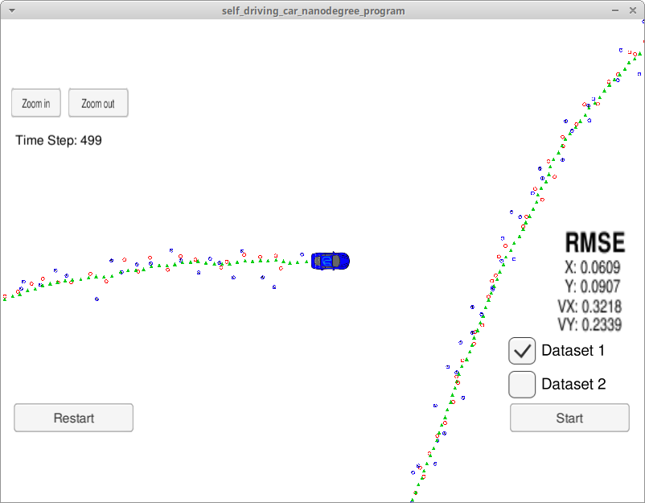
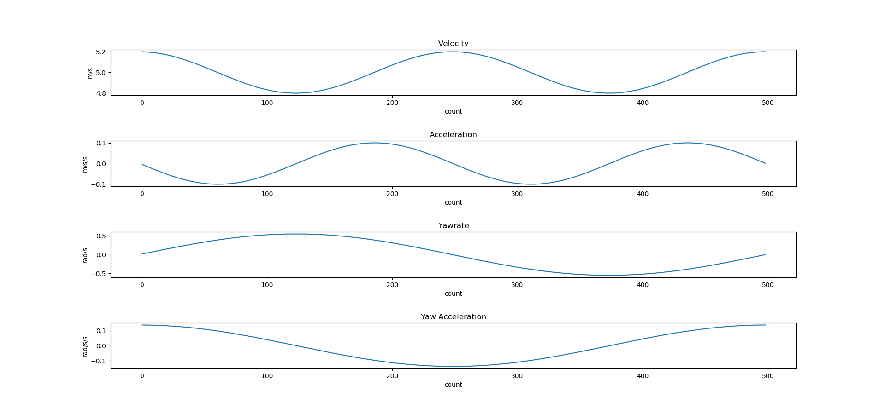
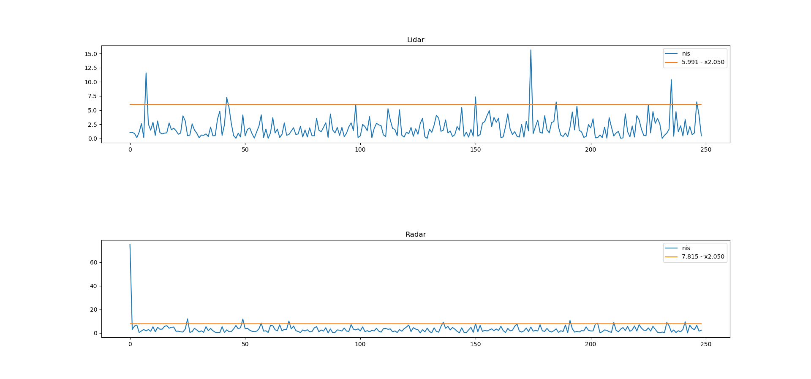

# Unscented Kalman Filter Project Starter Code
Self-Driving Car Engineer Nanodegree Program

In this project utilize an Unscented Kalman Filter to estimate the state of a moving object of interest with noisy lidar and radar measurements. Passing the project requires obtaining RMSE values that are lower that the tolerance outlined in the project rubric.

# How to build and run the project

For how to build and run the project, please refer to the readme at https://github.com/udacity/CarND-Unscented-Kalman-Filter-Project/blob/master/README.md

# Final Result
The final result is better than the result obtained with EKF (https://github.com/clarkli86/CarND-Extended-Kalman-Filter-Project). RMSE metrics especially `vx` and `vy` are much lower. This is because Unscented Kalman Filter tends to work better with non-linear transformations.

# Parameter Tuning and NIS Analysis
`std_a` and `std_yawdd` had to be turned to meet the requirements in the rubic (https://review.udacity.com/#!/projects/284/view). The default values (`30` and `30`) seem to keep the consistency in UKF (Unscented Kalman Filter) but does not acquire the required performance.

After looking at the statistics of simulation data, I decided to apply noises that are close to the standard deviation of longitudinal acceleration and yaw acceleration.

The final chosen parameters at listed in the following table:

| Parameter | Value | Note      |
|-----------|-------|-----------|
| std_a     | 0.285 | stdev * 4 |
| std_yawdd | 0.391 | stdev * 4 |

When these parameters were small, it was observed that RMSE values were out of spec, and the population of NIS samples greater than threshold is more than 5%. The NIS output suggests that the filter has underestimated the uncertainty, thus the noise covariances need to be increased.

The final chosen parameters demonstrats a resonable NIS plot.

